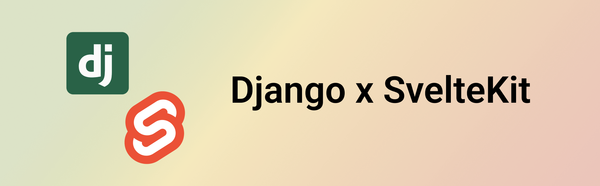

# Django-SvelteKit Starter

A production-ready monorepo template for building full-stack applications with Django (backend) and SvelteKit (frontend).

## 🚀 Features

- **Django Backend**: REST API with Django REST Framework, JWT auth, Celery task queue
- **SvelteKit Frontend**: Type-safe, fast, and modern UI with TypeScript
- **Type Safety**: Auto-generated TypeScript types from Django OpenAPI schema
- **Docker Compose**: One-command local development environment
- **Monorepo Benefits**: Atomic commits, shared tooling, simplified workflow
- **Production Ready**: Includes deployment configurations and infrastructure

## 📁 Project Structure

```
UFC_Fantasy/
├── backend/                # Django REST API
│   ├── project/            # Django project
│   ├── docker/             # Docker configuration
│   ├── ansible/            # Deployment automation
│   └── terraform/          # Infrastructure as code
├── frontend/               # SvelteKit application
│   ├── src/                # Source code
│   └── static/             # Static assets
├── docker-compose.yml      # Development environment
├── Makefile                # Common development commands
├── docs/                   # Project documentation
│   └── engineering-handbook/ # Engineering practices and standards
└── .github/                # CI/CD workflows
```

## 📋 Prerequisites

- Python 3.11+
- Node.js 20+
- Docker & Docker Compose
- Poetry (Python package manager)

## 🚀 Quick Start

1. **Clone the repository**

   ```bash
   git clone https://github.com/xande/UFC_Fantasy.git
   cd UFC_Fantasy
   ```

2. **Install dependencies**

   ```bash
   make install
   ```

3. **Start development environment**

   ```bash
   make run
   ```

4. **Access the applications**
   - Frontend: http://localhost:5173
   - Backend API: http://localhost:8000/api/
   - Django Admin: http://localhost:8000/aoi/admin/
   - API Documentation: http://localhost:8000/api/docs/

5. **Set up development data (optional)**
   ```bash
   make fresh-start
   ```
   This creates a clean database with default admin credentials:
   - **Email**: `admin@admin.com`
   - **Password**: `admin`

## ⚡ Development Commands

### Global Commands (from root directory)

```bash
make help               # Show all available commands
make install            # Install all dependencies + pre-commit hooks
make setup-pre-commit   # Install pre-commit hooks only
make sync-types         # Sync API types from backend to frontend
make run                # Start Docker Compose stack
make test               # Run all tests
make format             # Format code
make lint               # Lint code
make clean              # Clean generated files
```

### Backend Commands

```bash
cd backend/
poetry run python manage.py runserver   # Dev server
poetry run python manage.py migrate     # Run migrations
poetry run pytest                       # Run tests
poetry run python manage.py shell       # Django shell
```

### Frontend Commands

```bash
cd frontend/
npm run dev                 # Dev server (port 5173)
npm run sync-types         # Sync API types from backend (CRITICAL)
npm run build              # Production build
npm run check              # Type checking
npm run lint               # Lint code
npm run format             # Format code
```

## ⚙️ Configuration

### Database Setup

The project uses PostgreSQL. For development, the database runs in Docker via `docker-compose.yml`.

## 🔒 Type Safety

This monorepo emphasizes **type safety between frontend and backend**:

1. **Django** generates OpenAPI schema with `drf-spectacular`
2. **TypeScript types** are automatically generated from the schema using `openapi-typescript`
3. **Single command** synchronizes everything: `make sync-types`

**Always run after backend API changes:**

```bash
make sync-types
```

## 🔒 Code Quality & Pre-commit

This monorepo uses **intelligent pre-commit hooks** that only run when relevant files change:

- **Backend tools** (`backend/**/*.py`): black, isort, ruff, pyupgrade, django-upgrade, Django system checks
- **Frontend tools** (`frontend/**/*.{js,ts,svelte}`): prettier, eslint, svelte-check
- **Smart type sync**: Auto-generates TypeScript types when backend API files change

Pre-commit hooks are automatically installed with `make install`, or manually with `make setup-pre-commit`.

## 🚀 CI/CD & GitHub Actions

**Path-based GitHub Actions workflows** for efficient CI/CD:

- **Backend CI**: Triggers on `backend/**` changes - runs Django tests, migrations, linting
- **Frontend CI**: Triggers on `frontend/**` OR any `backend/**` changes - syncs types, runs tests/linting
- **Integration Tests**: Full Docker stack testing on main branch and PRs

✅ Backend changes → backend tests + frontend type sync (safe & reliable)
✅ Frontend changes → frontend tests only
✅ Integration tests catch full-stack issues

## 🔐 Authentication

- **JWT tokens** and a refresh token which is stored in HTTP-only cookies
- **Automatic token injection** via API client middleware
- **Route protection** in SvelteKit using server-side auth checks
- **Multi-tenant User model** uses **Django Sites framework** for tenancy
- **Email-based authentication** - users login with email, internal username is `site_id-email`
- **Admin authentication** - Django admin accepts email instead of internal username
- **Site-aware** - all authentication respects site boundaries for true multi-tenancy

### Multi-Tenancy Architecture

This starter template implements **multi-tenancy using Django's built-in Sites framework**:

- **Each tenant = Django Site** (no custom Tenant model needed)
- **Internal username format**: `{site_id}-{email}` (e.g., `"1-user@example.com"`)
- **Public interface**: Users only see and use email addresses
- **Site middleware**: Automatically identifies tenant from subdomain/domain
- **Isolated data**: Users can only access data within their site
- **Admin support**: Django admin works with email authentication across sites

## 🧪 Testing

### Backend Tests

```bash
cd backend/
poetry run pytest                    # Run all tests
poetry run pytest --cov             # With coverage
poetry run pytest tests/test_api.py  # Specific test file
```

### Frontend Tests

```bash
cd frontend/
npm run check    # Type checking
npm run lint     # Linting
npm test         # Unit tests (if configured)
```

## 🚀 Deployment

### Development

Use the root `docker-compose.yml` for simple development:

```bash
make run  # Starts all services
```

### Production

The backend includes comprehensive deployment configurations:

- **Docker**: Production-ready Dockerfile with multi-stage builds
- **Ansible**: Automated deployment to servers
- **Terraform**: Infrastructure provisioning
- **Celery**: Background task processing with Redis

See `backend/deploy.md` for detailed deployment instructions.

## 🤝 Contributing

1. Create a feature branch from `main`
2. Make your changes
3. Run tests: `make test`
4. Format code: `make format`
5. Create a pull request

## 📚 Documentation

- **docs/**: Comprehensive project documentation
  - **engineering-handbook/**: Engineering practices, standards, and workflows
- **backend/README.md**: Backend-specific documentation
- **frontend/README.md**: Frontend-specific documentation

**Built with 💚 using Django 4.2+, SvelteKit 2+, and modern development practices.**
