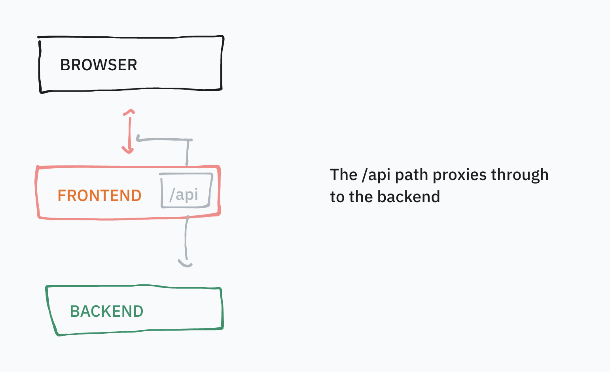

# Frontend Template (integrates with Backend Template)

## Backend Integration

All calls to the /api path are forwarded to the backend. See `src/hooks.server.ts` for more info.



## Installing

```bash
cp .env.example .env
npm install
npm run check
```

## Developing

```bash
npm run dev
```

## Building

To create a production version of your app:

```bash
npm run build
```

## Deploying

Add all environment variables listed in .env.example to Cloudflare Pages.

## Troubleshooting

If your IDE is complaining about missing modules, for example`Cannot find module '$lib/...' or '$app/...' from language server for .svelte files in default configuration of sveltekit`

run `npm run check` might resolve the issue. ([soure](https://github.com/sveltejs/language-tools/issues/1459#issuecomment-1465270092))
